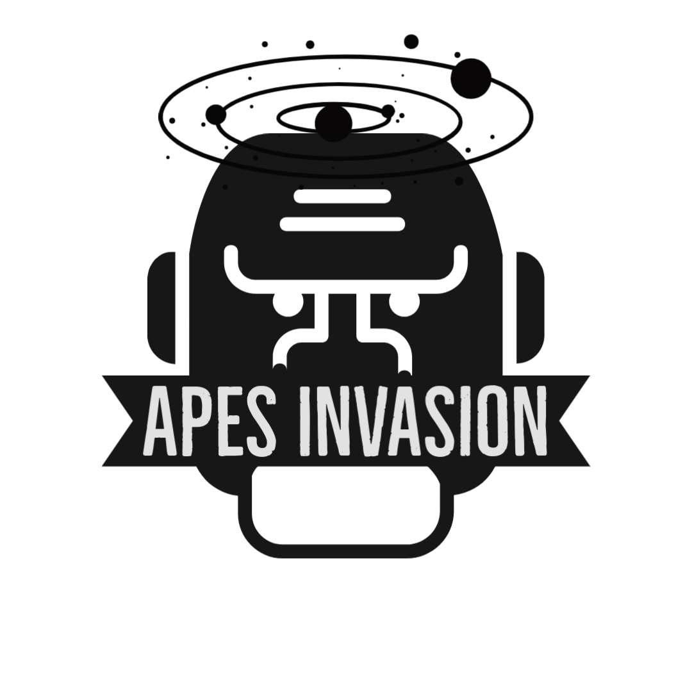

# Apes Invasion

Apes are invading the world! Save us!




<div align="center">
  
[](https://github.com/Eagle-Hunting-Game/contributors)
[](https://github.com/We2Am-BaSsem/GameX/issues)
[](https://github.com/We2Am-BaSsem/GameX/network)
[](https://github.com/We2Am-BaSsem/GameX/stargazers)
[](https://github.com/We2Am-BaSsem/GameX/blob/master/LICENSE)

</div>

## 📝 Table of Contents

- [Get Started](#Install)
- [Technology](#tech)
- [Included Libraries](#IncludedLibraries)
- [Screenshots](#Screenshots)
- [Play](#play)
- [Screenshots](#Screenshots)

## 💻 Built Using <a name = "tech"></a>
- [C++]()
- [OpenGL](https://www.opengl.org/)
## 🎮How to play<a name = "play"></a>
- Use *A* to move left.
- Use *D* to move right.
- Use *W* to move front.
- Use *S* to move back.
- Use *Right Click* to fire.

## 🎥 Demo <a name = "demo"></a>

[Youtube](https://youtu.be/R9aRxzWgib8)


https://user-images.githubusercontent.com/58189568/172469534-067e9042-5f13-4c73-bd14-5e0fc12ff827.mp4


## 🏁 Get Started <a name = "Install"></a>
1. **Clone the repository**
```
git clone https://github.com/We2Am-BaSsem/GameX.git
```
2. **Install Visual Studio Code**

3. **Open the folder in Visual Studio Code**

4. **Build the project**

5. **Open a terminal (Terminal > New Terminal)**

6. **Run this Command**
```
.\bin\GAME_APPLICATION.exe"
```

## 💻 Included Libraries <a name = "IncludedLibraries"></a>

- [glfw 3.3](https://github.com/glfw/glfw)
- [glad 2](https://github.com/Dav1dde/glad/tree/glad2)
- [glm 0.9.9.8](https://github.com/g-truc/glm)
- [imgui v1.78](https://github.com/ocornut/imgui)
- [json 3.9.1](https://github.com/nlohmann/json)
- [flags](https://github.com/sailormoon/flags)
- [stb](https://github.com/nothings/stb)
- [tinyobjloader v1.0.6](https://github.com/tinyobjloader/tinyobjloader)
- [tinygltf v2.4.0](https://github.com/syoyo/tinygltf)
- [bullet physics](https://github.com/bulletphysics/bullet3)
- [imguizmo](https://github.com/CedricGuillemet/ImGuizmo)


